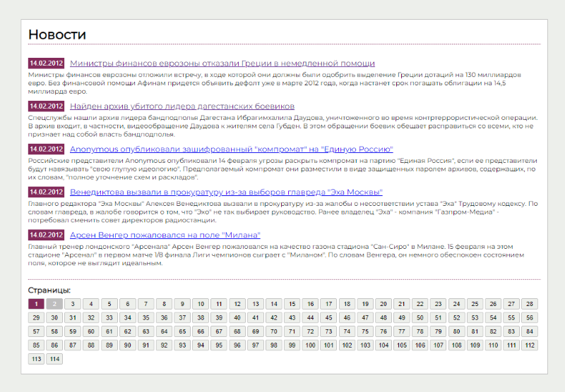

# Newswire website with HTML, CSS, PHP and MySQL

#### What has been implemented:

- a simple layout was developed to display the main page of the newswire with news headlines grouped into a block of 5 announcements

- clicking on the announcement link takes the article itself. at `http://news/view.php?id=[id]`

- news sorted by date, with latest news at the top of the list
- there is a link `Все новости >>`on the article page that takes you back to the main page
- linked `techart_news` database in _database.php_
- using `mysqli_fetch_array` function (returns one array with both numeric keys and associative strings (column names)), necessary data was fetched from `news` table
- to navigate between announcement blocks on the main page, the pages were shifted by 5 units

---

